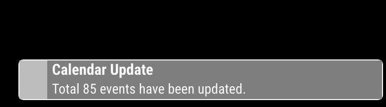

# MMM-AlertExt
Alternative alert module for MagicMirror

## Demo
[](https://www.youtube.com/watch?v=fT6oopGojMM)

[Click to Youtube](https://www.youtube.com/watch?v=fT6oopGojMM)

## Why?
- I need a more decorated alert feature than the current default `alert` module.
- Not only `SHOW_ALERT`, I want to see more various notifications and messages on the screen. (e.g. `Log.log()`, `UnhandledExceptionError`, `CALENDAR_UPDATED` notifications...)
- I make this module for a kind of shared programmable output-presenter of some modules.

## Installation
```sh
cd <MagicMirror Directory>/modules
git clone https://github.com/MMRIZE/MMM-AlertExt
```

## Configuration
> By the purpose of this module, you don't need the `default alert` module in your config. remove it from the config.

### The simplest config for lazy guys
**Trust me. Just this is enough.**
```js
{
  module: 'MMM-AlertExt',
},
```

### For serious(?) user
```js
{
  module: 'MMM-AlertExt',
  config: {
    notification: { disabled: false }, // to monitor all notification
    exception: { disabled: false }, // to monitor Frontend errors/exceptions
  }
}
```


### Details
Hmmm... I can bet the below detailed example would not be needed for most users, however, ...
```js
{
  disabled: false, // When you want to stop using this module, just set it as `true`
  module: 'MMM-AlertExt', // `Alert` is `prior` module, so doesn't need `position`
  config: {
    useIconify: true,
    defaultMaxStack: 10,
    template: './template.html',
    modularConfig: null, // './config/config.mjs'
    slotMaxStack: {
      'top-center': 1,
      'bottom-center': 5,
    },
    log: { disabled: true },
    exception: { disabled: true },
    notification: { disabled: false, slot: 'bottom-left', klass: 'my-custom-class' },
    alert: { slot: 'popover', duration: 100000, icon: '&#x2299'},
    alertNotification: { icon: 'fa-bell', slot: 'top-right' },
    message: { icon: 'mdi:flag' },

  }
}
```

- **`useIconify`**: You can use [`iconify`](https://iconify.design/) icons in addition to `font-awesome` or text.
- **`defaultMaxStack`**: How many messages would be stackable.
- **`template`** : Path of custom template file to design message custom element.
- **`slotMaxStack`** : You can set different maxStack counts per slot, instead of global `defaultMaxStack`. In this example, `bottom-center` slot would have max. 5 messages at a time. but `bottom-left` slot would have 10 by `defaultMaxStack`.
- **`modulearConfig`** : Instead of MM's default `config/config.js`, you can describe individual modular config for this module in an independent file.(e.g. `config.mjs`) See the `MMM-AlertExt/config/config.mjs.example` file. It has a slightly different format(ECMAScript) rather than legacy CommonJS(CJS). It is useful to keep the main config file shorter.

`alert: {}`, `alertNotification: {}`, `message: {}`, `notification: {}`, `log: {}` and `exception: {}` are the definition of behaviors of messages this module can handle.

Each definition object might have these sub-attributes. All the default values will be explained later.
```js
/* example */
message: {
  disabled: false,
  slot: 'top-left',
  klass: 'alert',
  icon: '',
  duration: 30000,
  // converter: (...) => { ... } // For expert.
},
```
- **`disabled`**: Whether to use this behavior or not.
- **`slot`**: Where to show; `top-left`, `top-right`, `top-center`, `bottom-left`, `bottom-center`, `bottom-right` and `popover` slots are available.
- **`klass`**: CSS class name for styling.
- **`icon`**: font-awesome(e.g. `fa-bell`) or iconify(e.g. `mdi:check`) identifier or any HTML/TEXT string(e.g. emoji).
- **`duration`**: How long time(milliseconds) the message will be displayed. If set as `0`, the message will not be disappeared. (But overflowed than `maxStack`, prior events will be dismissed by force.)


### Config Example - Only to show `AX_MESSAGE` notification
```js
{
  module: 'MMM-AlertExt',
  config: {
    log: { disabled: true },
    exception: { disabled: true },
    notification: { disabled: true },
    alert: { disabled: true },
    alertNotification: { disabled: true },
    message: { disabled: false }
  }
},
```

### Config Example - To show `SHOW_ALERT`(type: alert) on the top left corner with a red symbol 'X'.
```js
{
  module: 'MMM-AlertExt',
  config: {
    alert: {
      disabled: false,
      icon: '<font color="red">X</font>',
      slot: 'top-left',
    },
    // and other configs....
  }
}
```

### Config Example - Modular config
```js
/* in MM's config.js */
{
  module: 'MMM-AlertExt',
  config: {
    modularConfig: './config/config.mjs'
  }
}
```

```js
/* MMM-AlertExt/config/config.mjs */
const config = {
  defaultMaxSlot: 5,
  alert: { disabled: true },
  notification: {
    ...
    ...
}

export { config } // Don't remove this line.
```
> Instead of legacy CommonJS style, I prefer modern ECMAScript style (.mjs). Unfortunately, MM's default style is CJS. Don't confuse the file extension.

## Dive deeper
> Usually, a general user doesn't need below knowledge. The below information would be useful only to whom wants customization or development.

### 1. `SHOW_ALERT` (`alert` type)
If a certain module sends the notification `SHOW_ALERT`, this module will catch and present it.
```js
/* In some module */
this.sendNotification('SHOW_ALERT', {
  title: 'WARNING!',
  message: 'This mirror will be self-destructed In 5 seconds. ',
  imageUrl: 'https://somewhere.com/image/bomb.png',
  timer: 5000,
})
// Needless to say, how to use is the same to original...
```

By the default config, this behavior is defined as below.
```js
alert: { // default config values for alert
  disabled: false,
  slot: 'popover',
  duration: 30000,
  klass: 'alert',
  icon: 'fa-solid fa-bell',
  converter: (payload, sender) => { ... }
},
```
It means this notification will be shown on `popover` slot. All other things will be explained later.

Don't worry. If you are not a developer, you don't have to know anything else just to use this alternative `alert` module.

### 2. `SHOW_ALERT` (`notification` type)
Same. The only different thing is that the default slot is `top-right`. this kind of messages would be shown on `top-right` slot by default.
```js
alertNotification: { // default config values for alert-notification
  disabled: false,
  slot: 'top-right',
  duration: 10000,
  klass: 'message',
  icon: 'fa-bell',
  converter: (payload, sender, original) => { ... }
}
```

The difference between the `popover` slot and other normal slots are;
- `popover` slot is located in the center of the screen. It is not stackable. Only one message will be populated at once. The populated message would be dismissed by `timer`(or `duration`), or your action to dismiss(by touching/clicking the backdrop area).
- Otherwise, normal slots (e.g. `top-right`) would have many messages stacked up to stack counts defined as `maxStack` (`defaultMaxStack` or `slotMaxStack`). Overflowed messages will be dismissed when a new message arrives or its timer/duration ends.


### 3. Custom message `AX_MESSAGE`
Other modules can send `AX_MESSAGE` notifications to show custom messages on the slot.
```js
/* in other module */
this.sendNotification('AX_MESSAGE',
  title: 'Hello, there',
  message: 'Are you happy now?',
  slot: 'bottom-left',
  duration: 5000,
)
```
This will show the message in the `bottom-left` slot with the given attributes. If some attributes are omitted, default config values will be applied.
```js
message: { // Default config values for custom message
  disabled: false,
  slot: 'bottom-right',
  duration: 10000,
  klass: 'message',
  converter: (payload, sender) => { ... }
  callback: (signal, id, (obj)) => { ... }
},
```
Of course, you can redefine/override the default config values in the configuration.


### 4. All other notifications
If you want, you can show all or specific notifications between modules. By default, this feature is disabled. (There would be tons of notifications!)
```js
notification: { // Default config values for all other notifications
  disabled: true,
  slot: 'top-right',
  duration: 15000,
  klass: 'notification',
  converter: (notification, payload, sender) => { ... }
}
```
You'd better specify target notifications in `converter` function. (Yup. This also be explained later)


### 5. Log
If you want, You can see the result of MM's default logging tool - `Log` on the MM screen, not in the front-end dev-console. It is also disabled by default.
```js
log: { // Default config values for 'Log'
  disabled: true,
  slot: 'bottom-left',
  duration: 10000,
  converter: (method, context, location) => { ... }
}
```

### 6. Exceptions/Errors
You can show the Uncaught Errors or Unhandled Exceptions. This feature also be disabled by default.
```js
exception: { // Default config values for exceptions.
  disabled: true,
  slot: 'bottom-center',
  duration: 15000,
  icon: 'fa fa-bug',
  converter: (exception, location, message, event) => { ... }
}
```


## Converter
From various sources, to make a common message object, this module provides `converter` function to customize your message.


The default standard `message` object looks like this.
```js
{
  id: 'A1b2C3d4...',
  title: 'Notice'
  message: 'Time to Excersise!',
  klass: 'myCustomClass',
  icon: 'fa fa-dumbbell',
  slot: 'bottom-left',
  duration: 10000,
}
```
So, you may need to convert your notification to this standard format to display.

For example; You may want to display `how many events are broadcasted from the default calendar module`.
In that case, you can apply this custom converter for `notification`. This will override default converter for notification.

```js
{
  module: "MMM-AlertExt",
  config: {
    notification: {
      disabled: false, // activate it first.
      converter: (notification, payload, sender) => {
        if (notification === 'CALENDAR_EVENTS') {
          return {
            title: 'Calendar Update',
            message: `Total ${payload.length} events have been updated.`
            slot: 'bottom-right',
            // Default values defined will be applied to omitted attributes. (e.g. duration, icon,...)
          }
        } else {
          return null // Only CALENDAR_EVENTS notification would be displayed. Other notifications would be ignored by `return null`.
        }
      },
    }
  }
},
```
This will show something like this.



For each case, converters are slightly different. But all converters should return the same format `message` object.

```js
alert: {
  converter: (payload, sender) => { ...
  // payload : original payload for `SHOW_ALERT` notification.
  // sender : MagicMirror module instance object which sends this notification.
```

```js
alertNotification: {
  converter: (payload, sender) => { ...
  // payload : original payload for `SHOW_ALERT` notification.
  // sender : MagicMirror module instance object which sends this notification.
```

```js
notification: {
  converter: (notification, payload, sender) => { ...
  // notification : notification name which is emitted by `.sendNotification()`
  // payload : payload of notification.
  // sender : MagicMirror module instance object which sends this notification.
```

```js
message: {
  converter: (payload, sender) => { ...
  // payload : message object for `AX_MESSAGE` notification.
  // sender : MagicMirror module instance object which sends this notification.
```

```js
log: {
  converter: (method, context, location) => { ...
  // method : `log`, `debug`, `info`, `warn`, `error` or else.
  // context : Array of arguments which are carried in `Log.log()`. For example, `context` will have [`hello', 1] when `Log.log('hello', 1)` is called.
  // location: Where the `Log.log()` is called. (file, line, position)
```

```js
exception: {
  converter: (exception, location, message, event) => { ...
  // exception : error/exception type
  // location : Where the error/exception happens
  // message : Content of error/exception message
  // event : error/exception event object
```


## Styling
### Adjusting `slot`
See `ax-slot` related selectors in `MMM-AlertExt.css`. You can re-define and override them in `css/custom.css`. For example, you can override `#ax-slot-top-left` or `#ax .ax-slot.top.left` for your purpose. (And many other level of selectors are possible.)

### Styling message by `klass`
With selector `ax-message.CLASSNAME`, you can simply pour some sugar on the look.
```css
ax-message.alertNotification {
  --background-color: purple;
  --border-color: white;
  --font-color: white;
}

ax-message.myCustomClass {
  --background-color: red;
  --border-color: pink;
  --font-color: black;
}
```
Especially, each `Log` methods has its own class. (`log`, `info`, `debug`, `warn`, `error`)
```css
ax-message.info {
  --background-color: dodgerblue;
  --border-color: white;
  --font-color: white;
}
```

### Redefine of custom HTML element `ax-message`
`ax-message` is a custom element to display a complex message object on the MagicMirror. You can regard it as an HTML element like `div` or `img` tag.
Its look and structure are defined in `template.html`. If you are experienced, you can redefine this custom element for your purpose. (you may not need any explanation from me. :D)


## Handling mesages.
To control the message, there are some methods you can use.

### callback
You can assign `callback` as a payload when you emit your custom message or notification (including `SHOW_ALERT`). The `callback` function will be called when the message appears or disappears on the screen.

```js
/* In your module */
this.sendNotification('AX_MESSAGE', {
  id: 'myTestMessage',
  title: 'TEST',
  message: 'Lorem Ipsum ...',
  duration: 0,
  callback: (signal, id, msgObj) => {
    if (signal === 'CONNECTED') {
      console.log(`The message ${id} is shown`)
      setTimeout(() => { msgObj.die() }, 5000)
    }
    if (signal === 'DIED') {
      console.log(`The message ${id} is gone.`)
    }
  }
})
```
`callback` could have these parameters.
- `signal` : ATM, `CONNECTED` (when the message starts showing on the screen) and `DIED` (when the message disappears) are emittable.
- `id` : An unique identifier of the message.
- `msgObj` : `ax-message` element itself.
> `msgObj` itself is the same with `document.getElementById(id)`


### about `id`
By default, `id` is auto-generated by the module. However, you can assign your own `id` manually when you create the message notification.

If there is already a message that has the same `id` to the new creation, the previous message will be dismissed by force, and it will be replaced by this new one.

See the example.
```js
/* In your module */
this.sendNotification('AX_MESSAGE', {
  id: 'message1',
  title: 'I am immortal.',
  message: 'I will live forever!',
  duration: 0,
})
setTimeout(() => {
  this.sendNotification('AX_MESSAGE', {
    id: 'message1',
    title: 'New King',
    message: 'I can kill you.'
  })
}, 30000)
```
You can get the message element with this id.
```js
/* Somewhere in your module */
this.sendNotification('AX_MESSAGE', {
  id: 'abcd1234',
  title: 'Find Me',
  meesage: '...'
})
...
/* And in another place */
let msg = document.getElementById('abcd1234')
if (msg) msg.setMessage('Found!')
```

### Methods of `ax-message`
Once you obtain the message element, you can manipulate it with several prepared methods.

- `.setTitle(string)`: Reset title.
- `.setMessage(string)`: Reset message.
- `.setIcon(string)`: Reset icon.
- `.setKlass(string or string of Array)`: Reset klass.
- `.setDuration(ms)`: Reset duration.
- `.getDuration()`: get current duration.
- `.die()`: Kill the message instantly by force.

```js
this.sendNotification('AX_MESSAGE', {
    id: 'test',
    title: 'Mutable',
    message: '...',
    duration: 100000,
    callback: (signal, id, obj) => {
      // obj === document.getElementById(id)
      if (signal === 'CONNECTED') {
        obj.setMessage('After 3 seconds, this will die.')
        console.log(obj.getDuration())
        setTimeout(() => { obj.die() }, 3000)
      }
    })
  })
```

## History
### 1.0.0 (2024-02-29)
- Released


## Author
- Seongnoh Yi (eouia0819@gmail.com)

[](https://ko-fi.com/Y8Y56IFLK)
